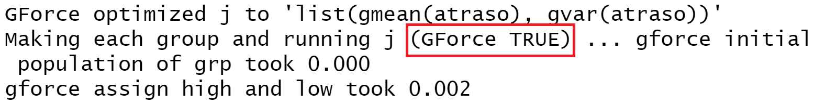
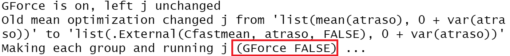

# Carga de datos y limpieza

```{r}
library(magrittr)
options(dplyr.summarise.inform = FALSE)
flights <- nycflights13::flights
data.table::setDT(flights)
data <- flights[!is.na(dep_delay) & !is.na(arr_delay), 
                .(destino = dest, atraso = arr_delay,
                  aerolinea = carrier)]


```


```{r, echo = FALSE}
knitr::kable(head(data, 4), format = 'html') 
```

Problema a resolver:

Para cada combinación de 4 aerolíneas, calcular la varianza y el promedio en el atraso a cada destino. 

Un caso de uso para calcular estas combinaciones, sería buscar una diversificación para disminuir riesgos.


# Cálculo de combinaciones

Con la función combn, generamos todas las combinaciones de 4 aerolíneas. Obtenemos una lista con 1820 elementos. Con esta estructura podremos apalancarnos de la funciones de `purrr` (o en R base la familia de funciones *apply) 

```{r}
combinaciones <- combn(x = unique(data$aerolinea), 
                       m = 4,
                       simplify = FALSE)

```

```{r, echo = FALSE}
kableExtra::kable(
  data.table::transpose(combinaciones[1:3]),
  col.names = NULL)
```

Ahora, creamos las funciones que reciben una de las combinaciones calculadas y devuelve el resumen deseado para esta combinación.
Acá tenemos 2 opciones: un resumen con dplyr y su equivalente en data.table. 


```{r}

dplyr_1 <- function(combinacion){
  data %>%
    dplyr::filter(aerolinea %in% combinacion) %>%
    dplyr::group_by(destino) %>%
    dplyr::summarise(media = mean(atraso),
                     varianza = var(atraso))
}
dt_1 <- function(combinacion){
  data[aerolinea %chin% combinacion,
       .(media = mean(atraso),
         varianza = var(atraso)),
       by = destino]
}

```
 


Obtenemos los mismos resultados para ambos casos. 

```{r}
resultados_dplyr <- dplyr_1(combinaciones[[1]]) %>% 
  dplyr::arrange(destino)

resultados_dt <- dt_1(combinaciones[[1]])[
  order(destino)]

kableExtra::kable(head(resultados_dt, 4))

all.equal(data.table::as.data.table(resultados_dplyr),
          resultados_dt)
```


Calculamos cuánto duran los cálculos hechos de manera secuencial con ambos métodos:

*Nota: Todas las mediciones fueron hechas múltiples veces y se verificó la consistencia entre las corridas*

Observamos que la opción con `data.table` es alrededor de 3 veces más rápida para calcular todos nuestros resúmenes. 
 
```{r}
tictoc::tic()

res_dplyr_1 <- purrr::map(combinaciones[1:2], dplyr_1)
tiempo_dplyr <- tictoc::toc(quiet = TRUE)

tictoc::tic()

res_dt_1 <- purrr::map(combinaciones[1:2], dt_1)
tiempo_dt <- tictoc::toc(quiet = TRUE)


```

```{r, echo = FALSE}
kableExtra::kable(data.table::data.table(
  tiempo_dplyr = tiempo_dplyr$toc - tiempo_dplyr$tic, 
  tiempo_dt = tiempo_dt$toc -tiempo_dt$tic))
```


# ¿Qué está pasando internamente?

Activemos las opción de que `data.table` nos diga qué está haciendo internamente. 

```{r, eval = FALSE}
options(datatable.verbose = TRUE)

dt_1(combinaciones[[1]])

```


```{r, echo=FALSE, out.width="95%"}

```

En vez de utilizar las funciones $mean$ y $var$ de R base, `data.table` utiliza las funciones $gmean$ y $gvar$ que están optimizadas en C++ para resúmenes por grupos. 


# Funciones que utilizan GForce

Las siguientes funciones están internamente optimizadas: 


```{r, echo = FALSE}
data.table::data.table(
  ` ` = c('min', 'max', 'mean', 'median', '.N'),
  ` ` = c('var', 'sd', 'sum', 'prod', ''),
  ` `= c('first', 'last', 'head' , 'tail', '')) %>%
  kableExtra::kable()
```

Es importante tomar esto en cuenta, pues esas son las únicas funciones que están optimizadas. Por ejemplo, una suma dentro del cálculo de la varianza apaga GForce

```{r, eval = FALSE}
dt_2 <- function(combinacion){
  data[aerolinea %chin% combinacion,
       .(media = mean(atraso),
         varianza = 0 + var(atraso)),
       by = destino]
}

dt_2(combinaciones[[1]])
```
 
```{r, echo=FALSE, out.width="95%"}

```

dplyr tiene su equivalente llamado [Hybrid Evaluation](https://dplyr.tidyverse.org/articles/future/dplyr_0.8.0_new_hybrid.html), que también optimiza resúmenes por grupo. 


# ¡Resúmenes (más) rápido!

`data.table` tiene la capacidad de indexar columnas, por lo que los filtros y resúmenes los hace más rápido aún. 

```{r}

dt_3 <- function(combinacion){
  data[.(combinacion), # Filtro a la aerolínea
       .(media = mean(atraso),
         varianza = var(atraso)),
       by = 'destino']
}

tictoc::tic()
data.table::setkey(data, aerolinea)

res_dt_3 <- purrr::map(combinaciones[1:2], dt_3)
tiempo_dt_3 <- tictoc::toc(quiet = TRUE)

kableExtra::kable(data.table::data.table(
  tiempo_dt = tiempo_dt$toc -tiempo_dt$tic,
  tiempo_dt_3 = tiempo_dt_3$toc - tiempo_dt_3$tic
))


```

Vemos que hemos optimizado nuestros resúmenes aun más. Además, podríamos paralelizar nuestros resúmenes y hacer millones en poco tiempo. 

# Referencias

Glasman, Brodie _A strategy for faster group statistics_ <https://www.brodieg.com/2019/02/24/a-strategy-for-faster-group-statisitics/>

  Gorecki, Jan _Optimizations in data.table_ <https://jangorecki.gitlab.io/data.table/library/data.table/html/datatable-optimize.html>

\small\printbibliography
